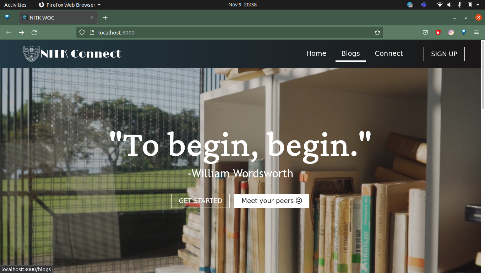
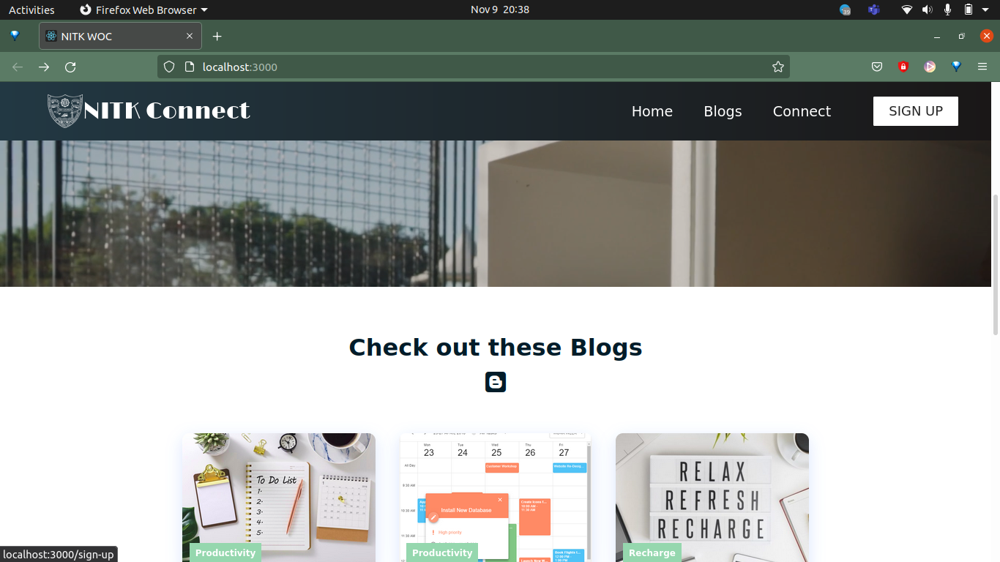
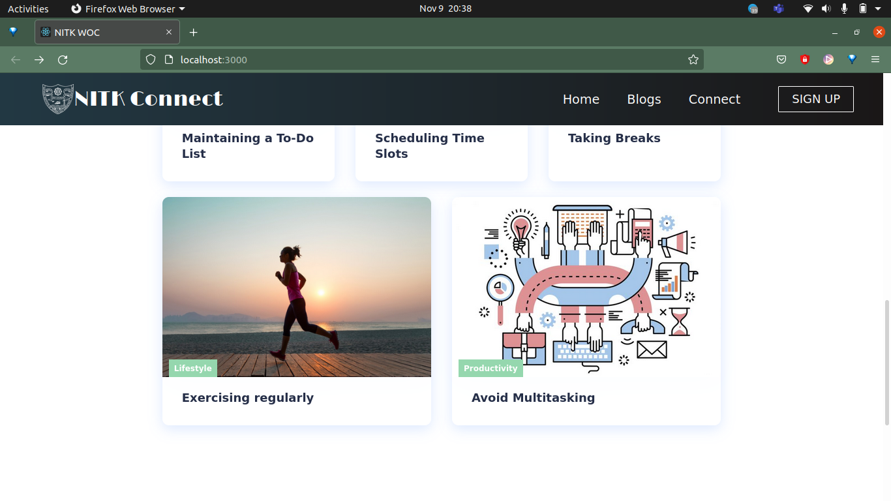
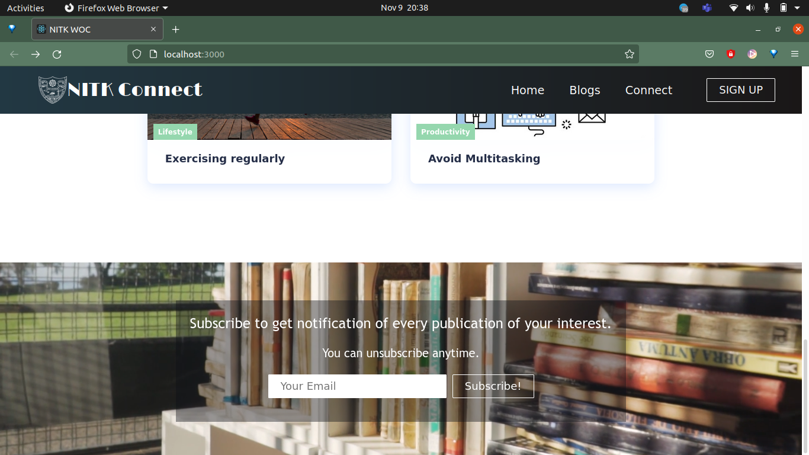

# Connect-demo

This a responsive dummy website containing only landing page built using ReactJS.

Designed as a part of submission for [Winter of Code - NIT Surathkal](https://woc-nitk.github.io/#/)

More features can be added according to needs.

This project was bootstrapped with [Create React App](https://github.com/facebook/create-react-app).

Steps to be followed:

1. Clone this repository in your system.

In the project directory, run:

2. `npm install`\
This will install all required packages used this project.

3. `npm start`\
This runs the app in the development mode.\
Open [http://localhost:3000](http://localhost:3000) to view it in the browser.

The page will reload if you make edits.\
You will also see any lint errors in the console.

### Screenshots:
 

 

